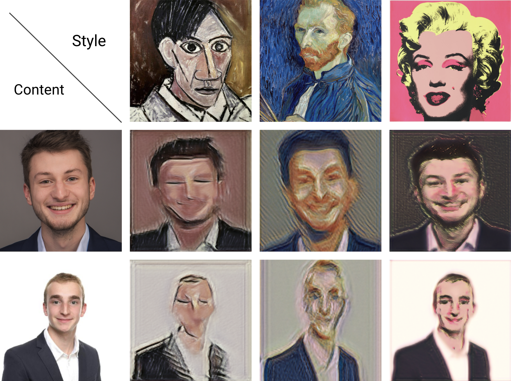
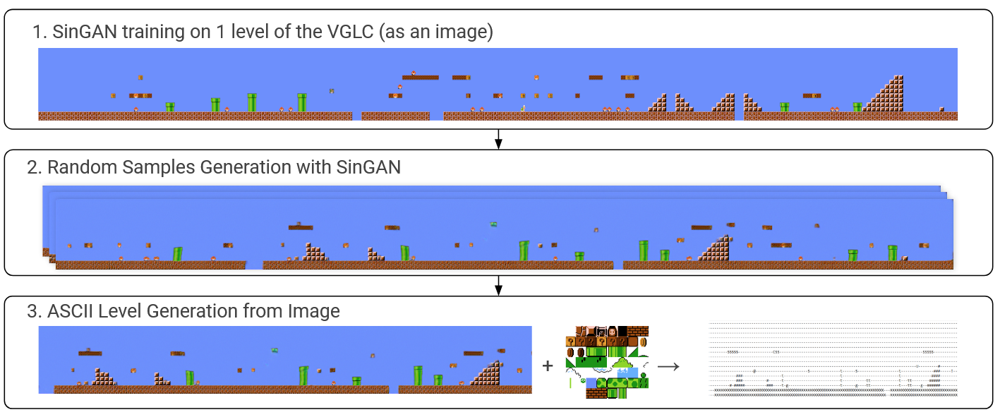
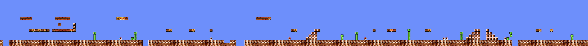
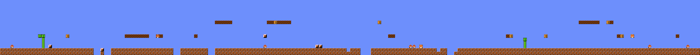
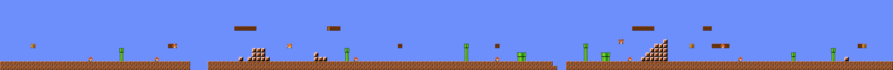

# SinGAN - RecVis Course Project, Master MVA

Project for the course "Object Recognition and Computer Vision" of the Master MVA (2020-2021).

The goal of the project was to study the method described in the paper "SinGAN: Learning a Generative Model from a Single Natural Image", reproduce the paper's results, and evaluate its power for *Style Transfer* and *Procedural Content Generation*.

Most of the code comes directly from the original github https://github.com/tamarott/SinGAN
The VGUtils folder contains the files used in the generation of levels from the VGLC Mario level. It is based on https://github.com/Mawiszus/TOAD-GAN/tree/master/mario and https://github.com/amidos2006/Mario-AI-Framework

See our report for more information and results.

## Results on Style Transfer

## Results on Mario Level Generator

